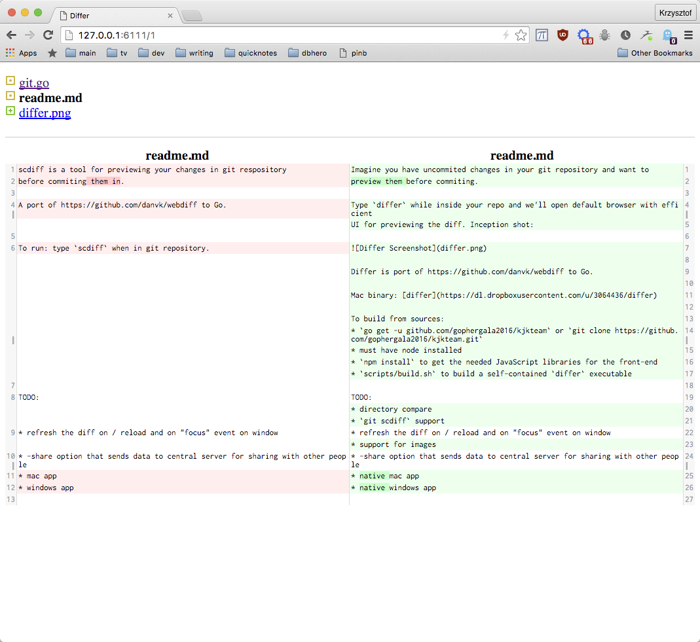

## Differ is for previewing uncommitted git changes

Imagine you have uncommited changes in your git repository and want to
preview them before commiting.

Type `differ` and get browser-based, efficient UI for previewing the changes. Inception shot:

Use `j`/`k` for next/previous file.

## Origin story

Differ is a port of https://github.com/danvk/webdiff from Python to Go.

## Download

Mac binary: [differ](https://dl.dropboxusercontent.com/u/3064436/differ)

## Building from sources

Pre-requisites:
* node, for getting JavaScript libraries used in the front-end. `brew install node` on mac.
* `zopfli` (`brew install zopfli` on mac) for maximum compression of
  front-end assets

Build steps:
* `go get -u github.com/gophergala2016/kjkteam` or `git clone https://github.com/gophergala2016/kjkteam.git`
* `npm install` to get the needed JavaScript libraries for the front-end
* `scripts/build.sh` to build a self-contained `differ` executable

## Team

[Krzysztof Kowalczyk](https://github.com/kjk)

## Todo

* directory compare
* `git scdiff` support
* refresh the diff on / reload and on "focus" event on window
* support for diffing images
* -share option that sends data to central server for sharing with other people
* native mac app
* native windows app
* try more random port numbers if can't bind to the one we want
